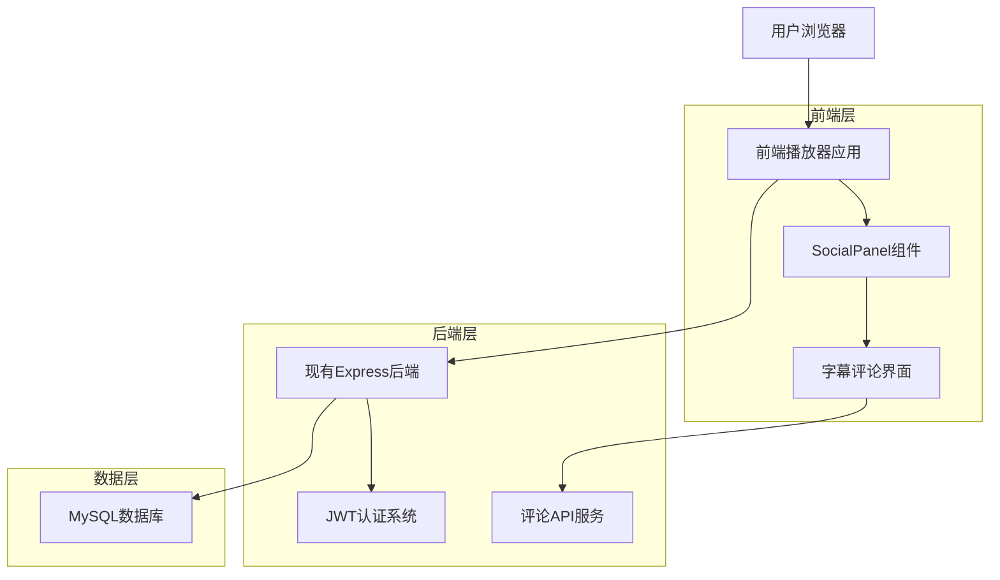
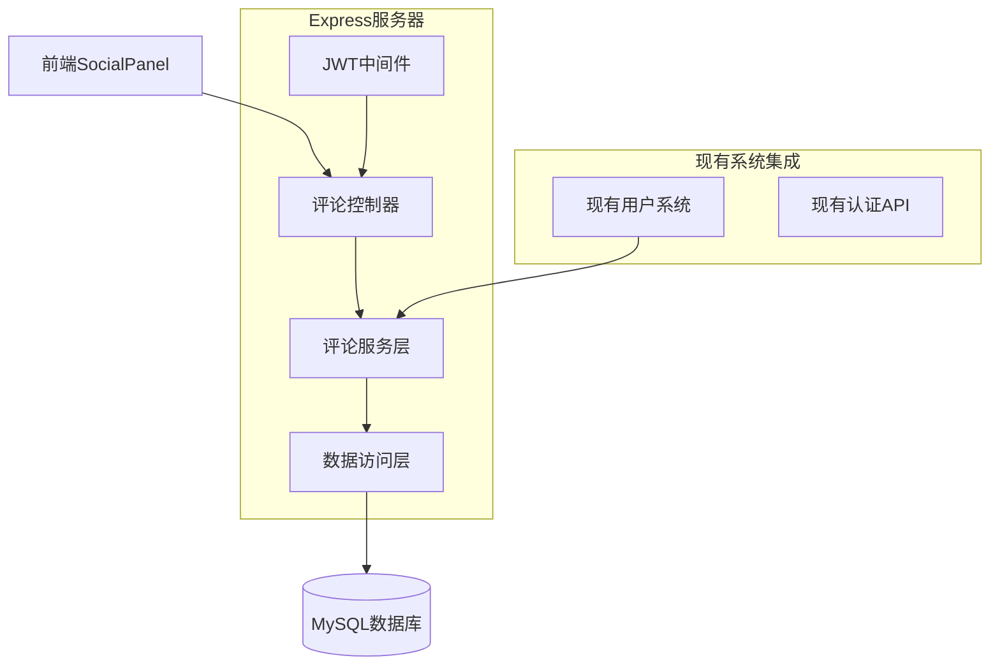
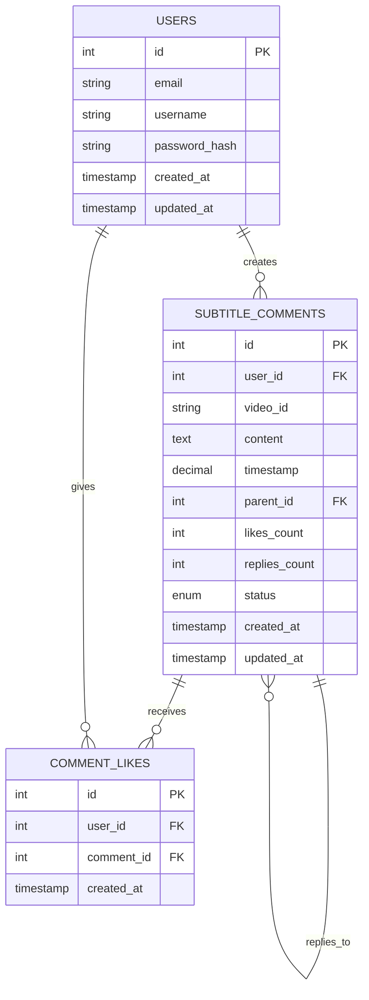

# 字幕评论功能技术架构文档

## 1.架构设计



## 2.技术描述

- 前端：原生JavaScript + Video.js + 现有SocialPanel组件
- 后端：Express.js + 现有JWT认证系统
- 数据库：MySQL（现有数据库）
- 样式：CSS3 + 现有样式系统

## 3.前端组件集成

| 组件名称 | 集成位置 | 用途 |
|-------|------|------|
| SocialPanel | 现有播放器界面 | 社交功能面板容器 |
| SubtitleCommentPanel | SocialPanel内部 | 字幕评论功能界面 |
| CommentList | SubtitleCommentPanel | 评论列表展示 |
| CommentInput | SubtitleCommentPanel | 评论输入组件 |
| UserAvatar | CommentList项 | 用户头像生成组件 |
| LoginPrompt | SubtitleCommentPanel | 未登录提示界面 |

## 4.API定义

### 4.1 评论相关API

获取视频评论列表
```
GET /api/comments/:videoId
```

请求参数：
| 参数名称 | 参数类型 | 是否必需 | 描述 |
|---------|---------|---------|-----|
| videoId | string | true | 视频ID |
| page | number | false | 页码，默认1 |
| limit | number | false | 每页数量，默认20 |
| timestamp | number | false | 筛选时间点附近评论（秒） |

响应参数：
```json
{
  "success": true,
  "data": {
    "comments": [
      {
        "id": "comment_id",
        "content": "评论内容",
        "timestamp": 120.5,
        "userId": "user_id",
        "username": "用户名",
        "createdAt": "2024-01-01T00:00:00Z",
        "likes": 5,
        "replies": 2
      }
    ],
    "total": 100,
    "hasMore": true
  }
}
```

发表评论
```
POST /api/comments
```

请求参数：
| 参数名称 | 参数类型 | 是否必需 | 描述 |
|---------|---------|---------|-----|
| videoId | string | true | 视频ID |
| content | string | true | 评论内容 |
| timestamp | number | true | 评论时间点（秒） |
| parentId | string | false | 父评论ID（回复时） |

### 4.2 用户认证集成

使用现有的JWT认证系统：
- 请求头：`Authorization: Bearer <token>`
- 用户信息从现有的用户认证接口获取
- 登录状态检查使用现有的 `isLoggedIn()` 方法

#### 管理员API

**获取待审核评论**

```
GET /api/admin/comments/pending
```

**审核评论**

```
POST /api/admin/comments/:id/review
```

请求:

| 参数名    | 参数类型   | 是否必需  | 描述                   |
| ------ | ------ | ----- | -------------------- |
| action | string | true  | 'approve' 或 'reject' |
| reason | string | false | 拒绝原因                 |

## 5.服务器架构图



## 6.数据模型

### 6.1 数据模型定义



### 6.2 头像生成算法

```javascript
// 基于用户名生成头像的算法
function generateUserAvatar(username) {
    // 获取用户名首字母
    const initial = username.charAt(0).toUpperCase();
    
    // 基于用户名生成稳定的颜色
    const colors = [
        '#FF6B6B', '#4ECDC4', '#45B7D1', '#96CEB4', 
        '#FFEAA7', '#DDA0DD', '#98D8C8', '#F7DC6F',
        '#BB8FCE', '#85C1E9', '#F8C471', '#82E0AA'
    ];
    
    let hash = 0;
    for (let i = 0; i < username.length; i++) {
        hash = username.charCodeAt(i) + ((hash << 5) - hash);
    }
    
    const colorIndex = Math.abs(hash) % colors.length;
    const backgroundColor = colors[colorIndex];
    
    return {
        initial: initial,
        backgroundColor: backgroundColor,
        textColor: '#FFFFFF'
    };
}
```

### 6.3 数据定义语言

字幕评论表 (subtitle_comments)
```sql
-- 创建字幕评论表
CREATE TABLE subtitle_comments (
    id INT AUTO_INCREMENT PRIMARY KEY,
    user_id INT NOT NULL,
    video_id VARCHAR(255) NOT NULL,
    content TEXT NOT NULL,
    timestamp DECIMAL(10,3) NOT NULL COMMENT '视频时间点（秒）',
    parent_id INT NULL COMMENT '父评论ID，用于回复',
    likes_count INT DEFAULT 0,
    replies_count INT DEFAULT 0,
    status ENUM('pending', 'approved', 'rejected', 'deleted') DEFAULT 'approved',
    created_at TIMESTAMP DEFAULT CURRENT_TIMESTAMP,
    updated_at TIMESTAMP DEFAULT CURRENT_TIMESTAMP ON UPDATE CURRENT_TIMESTAMP,
    
    FOREIGN KEY (user_id) REFERENCES users(id) ON DELETE CASCADE,
    FOREIGN KEY (parent_id) REFERENCES subtitle_comments(id) ON DELETE CASCADE
);

-- 评论点赞表
CREATE TABLE comment_likes (
    id INT AUTO_INCREMENT PRIMARY KEY,
    user_id INT NOT NULL,
    comment_id INT NOT NULL,
    created_at TIMESTAMP DEFAULT CURRENT_TIMESTAMP,
    
    FOREIGN KEY (user_id) REFERENCES users(id) ON DELETE CASCADE,
    FOREIGN KEY (comment_id) REFERENCES subtitle_comments(id) ON DELETE CASCADE,
    UNIQUE KEY unique_user_comment (user_id, comment_id)
);

-- 创建索引
CREATE INDEX idx_subtitle_comments_video_id ON subtitle_comments(video_id);
CREATE INDEX idx_subtitle_comments_timestamp ON subtitle_comments(timestamp);
CREATE INDEX idx_subtitle_comments_user_id ON subtitle_comments(user_id);
CREATE INDEX idx_subtitle_comments_parent_id ON subtitle_comments(parent_id);
CREATE INDEX idx_subtitle_comments_created_at ON subtitle_comments(created_at DESC);
CREATE INDEX idx_comment_likes_comment_id ON comment_likes(comment_id);
```

### 6.4 与现有系统集成

- 使用现有的 `users` 表进行用户认证
- 集成现有的JWT token验证机制
- 复用现有的API_BASE_URL配置
- 遵循现有的错误处理和响应格式规范

