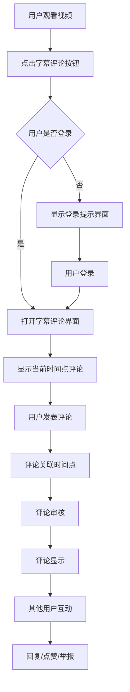

# 字幕评论功能需求文档

## 1. 产品概述

为现有的M3U8视频播放器添加字幕评论功能，允许用户对特定时间点的字幕进行评论、回复和互动。该功能将增强用户观看体验，提供社区互动平台，支持桌面端和移动端响应式设计。

* 核心目标：为用户提供基于时间轴的字幕评论互动功能，增强观看体验和社区参与度

* 目标用户：视频观看者、字幕爱好者、社区互动用户

* 市场价值：提升用户粘性，构建活跃的视频评论社区，增加平台互动性

## 2. 核心功能

### 2.1 用户角色

| 角色   | 注册方式   | 核心权限            |
| ---- | ------ | --------------- |
| 注册用户 | 邮箱注册验证 | 可查看、发表评论、回复、点赞、举报  |
| 管理员  | 后台分配   | 可删除评论、封禁用户、管理举报 |

**注意：** 游客用户无法查看和使用评论功能，必须登录后才能访问字幕评论界面。

### 2.2 功能模块

本字幕评论功能集成在现有社交面板中，包含以下主要模块：

1. **字幕评论界面**：集成在社交面板中的字幕评论功能入口
2. **评论列表**：评论展示、时间轴定位、滚动加载
3. **评论发布器**：文本输入、表情支持、时间点关联
4. **用户互动**：点赞、回复、举报功能
5. **头像系统**：基于用户名首字母的自动头像生成
6. **管理后台**：评论审核、用户管理、数据统计

### 2.3 页面详情

| 页面名称  | 模块名称   | 功能描述                      |
| ----- | ------ | ------------------------- |
| 播放器页面 | 社交面板入口 | 现有的"字幕评论"按钮，点击打开社交面板的字幕评论界面 |
| 社交面板  | 字幕评论界面 | 集成在社交面板中的评论功能，需要登录才能访问 |
| 社交面板  | 登录检查   | 未登录用户显示登录提示，已登录用户显示评论内容 |
| 社交面板  | 评论列表   | 按时间轴排序显示评论，支持滚动加载和时间跳转 |
| 社交面板  | 评论发布器  | 支持文本输入、表情选择、时间点标记 |
| 社交面板  | 用户头像   | 基于用户名首字母生成的彩色圆形头像 |
| 社交面板  | 评论互动   | 点赞、回复、举报等操作按钮 |
| 播放器页面 | 时间轴标记  | 在进度条上显示有评论的时间点标记 |
| 管理后台  | 评论管理   | 评论列表、审核、删除、用户管理功能 |
| 管理后台  | 数据统计   | 评论数量、用户活跃度、热门时间点统计 |

## 3. 核心流程

### 3.1 用户评论流程

1. 用户观看视频时点击社交面板中的"字幕评论"按钮
2. 系统检查用户登录状态
3. 未登录用户显示登录提示界面
4. 已登录用户打开字幕评论界面，显示当前时间点附近的评论
5. 用户可以发表新评论，评论自动关联当前播放时间点
6. 其他已登录用户可以对评论进行回复、点赞等互动

### 3.2 管理员审核流程

1. 系统自动检测敏感词汇和垃圾评论
2. 可疑评论进入待审核状态
3. 管理员在后台审核评论内容
4. 审核通过的评论正常显示，拒绝的评论被隐藏或删除

## 4. 用户界面设计

### 4.1 设计风格

* **主色调**：深色主题 (#0f0f0f 背景，#fff 文字)

* **辅助色**：蓝色 (#007cba) 用于链接和按钮，灰色 (#333, #555) 用于边框和次要元素

* **按钮样式**：圆角矩形，悬停效果，支持禁用状态

* **字体**：Arial, Helvetica, sans-serif，评论内容 14px，时间戳 12px

* **布局风格**：卡片式设计，响应式布局，移动端抽屉式面板

* **图标风格**：线性图标，SVG格式，支持主题色彩适配

### 4.2 页面设计概览

| 页面名称  | 模块名称   | UI元素                                  |
| ----- | ------ | ------------------------------------- |
| 播放器页面 | 字幕评论按钮 | 现有社交面板中的字幕评论按钮，SVG图标，位于点赞按钮右侧 |
| 社交面板  | 登录检查界面 | 未登录时显示：登录提示文案、登录按钮、功能说明 |
| 社交面板  | 评论界面   | 已登录时显示：评论列表区域、评论输入区域 |
| 社交面板  | 评论列表   | 虚拟滚动列表，每条评论包含自动生成头像、用户名、时间戳、内容、互动按钮 |
| 社交面板  | 用户头像   | 圆形头像，显示用户名首字母，随机背景色（基于用户名哈希） |
| 社交面板  | 评论输入框  | 多行文本框，表情按钮，发送按钮，字数统计，当前时间点显示 |
| 播放器页面 | 时间轴标记  | 进度条上的小圆点标记，悬停显示评论预览 |
| 社交面板  | 评论卡片   | 圆角卡片，左侧自动头像，右侧内容区，底部互动按钮行 |

### 4.3 响应式设计

* **桌面端优先**：>=1024px 使用侧边栏面板布局

* **移动端适配**：<768px 使用底部抽屉式面板，支持手势操作

* **平板端**：768px-1023px 使用紧凑型侧边栏或可切换的浮动面板

* **触摸优化**：移动端按钮最小 44px 点击区域，支持滑动手势

