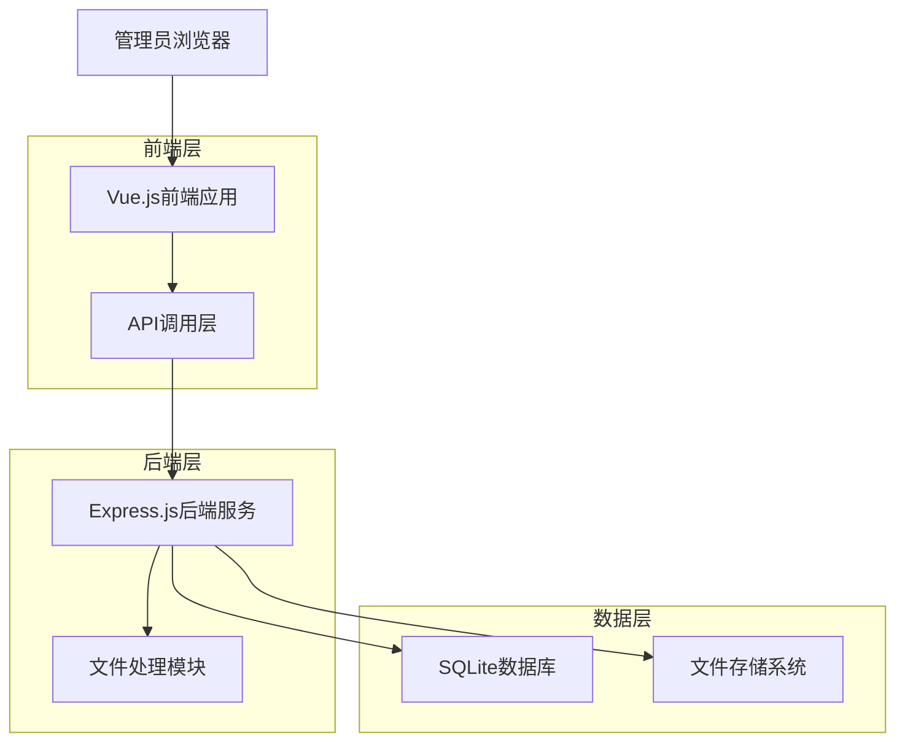
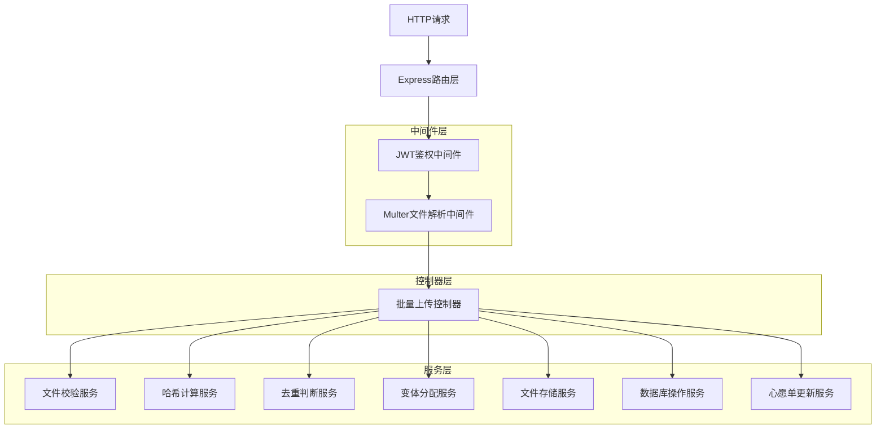
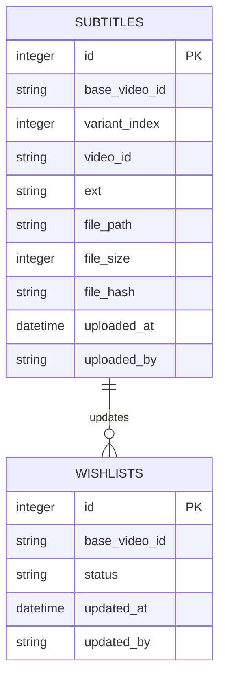

# 心愿单批量上传字幕功能技术架构文档

## 1. 架构设计



## 2. 技术描述

* **前端**: Vue.js\@3 + Element Plus + Vite

* **后端**: Express.js\@4 + Multer + SQLite3

* **文件处理**: Node.js crypto模块 + fs模块

* **数据库**: SQLite（现有数据库扩展）

## 3. 路由定义

| 路由               | 用途                    |
| ---------------- | --------------------- |
| /admin           | 管理员主页面，包含心愿单管理和批量上传功能 |
| /admin/wishlists | 心愿单列表页面，显示所有心愿单和状态    |

## 4. API定义

### 4.1 核心API

**批量上传字幕文件**

```
POST /api/admin/subtitles/batch-upload
```

**请求头:**

| 参数名           | 参数类型   | 是否必填 | 描述                      |
| ------------- | ------ | ---- | ----------------------- |
| Authorization | string | true | Bearer JWT token（管理员权限） |
| Content-Type  | string | true | multipart/form-data     |

**请求参数:**

| 参数名   | 参数类型    | 是否必填 | 描述                   |
| ----- | ------- | ---- | -------------------- |
| files | File\[] | true | 字幕文件数组，支持.srt/.vtt格式 |

**响应参数:**

| 参数名              | 参数类型      | 描述               |
| ---------------- | --------- | ---------------- |
| total            | number    | 本次提交的文件总数        |
| accepted         | number    | 通过校验进入处理的数量      |
| savedNew         | number    | 新保存的文件数量         |
| skippedDuplicate | number    | 因哈希重复而跳过的数量      |
| invalidFilename  | number    | 命名不合规的文件数量       |
| oversize         | number    | 超出大小限制的文件数量      |
| updatedVideoIds  | string\[] | 被标记为"已更新"的视频编号列表 |
| items            | object\[] | 详细处理结果列表         |

**响应示例:**

```json
{
  "total": 5,
  "accepted": 4,
  "savedNew": 3,
  "skippedDuplicate": 1,
  "invalidFilename": 1,
  "oversize": 0,
  "updatedVideoIds": ["NINM-027", "IPX-1234", "ABP-1234"],
  "items": [
    {
      "filename": "NINM-027.srt",
      "baseVideoId": "NINM-027",
      "status": "saved",
      "assignedVideoId": "NINM-027-2"
    },
    {
      "filename": "IPX-1234.vtt",
      "baseVideoId": "IPX-1234",
      "status": "duplicate",
      "reason": "文件内容与已有字幕重复"
    },
    {
      "filename": "invalid_name.srt",
      "status": "invalid",
      "reason": "文件名格式不符合要求"
    }
  ]
}
```

## 5. 服务器架构图



## 6. 数据模型

### 6.1 数据模型定义



### 6.2 数据定义语言

**字幕表扩展（subtitles）**

```sql
-- 扩展现有subtitles表结构
ALTER TABLE subtitles ADD COLUMN base_video_id VARCHAR(50);
ALTER TABLE subtitles ADD COLUMN variant_index INTEGER DEFAULT 0;
ALTER TABLE subtitles ADD COLUMN file_hash VARCHAR(64);
ALTER TABLE subtitles ADD COLUMN uploaded_by VARCHAR(100);

-- 创建索引提升查询性能
CREATE INDEX idx_subtitles_base_video_id ON subtitles(base_video_id);
CREATE INDEX idx_subtitles_file_hash ON subtitles(file_hash);
CREATE UNIQUE INDEX idx_subtitles_base_variant ON subtitles(base_video_id, variant_index);
CREATE UNIQUE INDEX idx_subtitles_base_hash ON subtitles(base_video_id, file_hash);

-- 心愿单表（如果不存在则创建）
CREATE TABLE IF NOT EXISTS wishlists (
    id INTEGER PRIMARY KEY AUTOINCREMENT,
    base_video_id VARCHAR(50) NOT NULL,
    title VARCHAR(200),
    status VARCHAR(20) DEFAULT '未更新',
    created_at DATETIME DEFAULT CURRENT_TIMESTAMP,
    updated_at DATETIME DEFAULT CURRENT_TIMESTAMP,
    updated_by VARCHAR(100)
);

-- 创建心愿单索引
CREATE INDEX idx_wishlists_base_video_id ON wishlists(base_video_id);
CREATE INDEX idx_wishlists_status ON wishlists(status);

-- 初始化测试数据
INSERT INTO wishlists (base_video_id, title, status) VALUES 
('NINM-027', '测试视频1', '未更新'),
('IPX-1234', '测试视频2', '未更新'),
('ABP-1234', '测试视频3', '未更新');
```

**文件处理核心逻辑**

```javascript
// 文件名解析正则表达式
const VIDEO_ID_PATTERN = /^([A-Za-z0-9]+-\d{3,})\.(srt|vtt)$/i;

// 哈希计算函数
function calculateFileHash(filePath) {
    const crypto = require('crypto');
    const fs = require('fs');
    
    return new Promise((resolve, reject) => {
        const hash = crypto.createHash('sha256');
        const stream = fs.createReadStream(filePath);
        
        stream.on('data', data => hash.update(data));
        stream.on('end', () => resolve(hash.digest('hex')));
        stream.on('error', reject);
    });
}

// 变体编号分配函数
function getNextVariantIndex(baseVideoId, db) {
    return new Promise((resolve, reject) => {
        const sql = `
            SELECT MAX(variant_index) as max_index 
            FROM subtitles 
            WHERE base_video_id = ? COLLATE NOCASE
        `;
        
        db.get(sql, [baseVideoId], (err, row) => {
            if (err) reject(err);
            else resolve((row?.max_index || -1) + 1);
        });
    });
}
```

