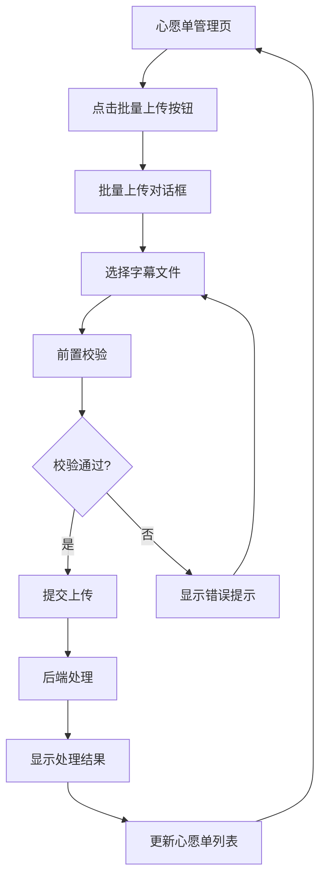

# 心愿单批量上传字幕功能需求文档

## 1. 产品概述

本功能为心愿单管理系统新增批量上传字幕文件能力，支持管理员在心愿单界面直接上传多个字幕文件，自动完成去重、变体编号分配和心愿单状态更新。

该功能解决了管理员需要逐个处理心愿单字幕上传的效率问题，通过智能化的文件处理和状态联动，大幅提升字幕管理工作效率。

## 2. 核心功能

### 2.1 用户角色

| 角色 | 权限说明 | 核心功能 |
|------|----------|----------|
| 管理员 | JWT鉴权验证 | 可访问批量上传功能，查看上传结果，管理心愿单状态 |
| 普通用户 | 无权限 | 无法访问批量上传功能 |

### 2.2 功能模块

本功能主要包含以下核心页面和模块：

1. **心愿单管理页面**：新增批量上传入口按钮，集成上传对话框
2. **批量上传对话框**：文件选择、校验、上传进度显示和结果展示
3. **后端处理接口**：文件解析、哈希计算、去重判断、变体分配和数据存储

### 2.3 页面详情

| 页面名称 | 模块名称 | 功能描述 |
|----------|----------|----------|
| 心愿单管理页 | 批量上传入口 | 新增"批量上传字幕"按钮，点击打开上传对话框 |
| 批量上传对话框 | 文件选择器 | 支持多文件选择，限制.srt/.vtt格式，最多200个文件 |
| 批量上传对话框 | 前置校验 | 文件名格式校验、扩展名检查、数量和大小限制验证 |
| 批量上传对话框 | 上传进度 | 显示上传进度条和实时状态信息 |
| 批量上传对话框 | 结果展示 | 按状态分组显示处理结果（成功/重复/无效/失败） |
| 心愿单列表 | 状态更新 | 自动更新对应视频的状态为"已更新"，按钮文案改为"标记未更新" |

## 3. 核心流程

### 3.1 批量上传主流程

用户在心愿单管理页面点击"批量上传字幕"按钮，打开上传对话框。选择多个字幕文件后，系统进行前置校验，通过后提交到后端处理。后端逐个处理文件，进行哈希计算和去重判断，为新文件分配变体编号并保存。处理完成后更新对应心愿单状态，返回详细结果供前端展示。

### 3.2 页面导航流程图

## 4. 用户界面设计

### 4.1 设计风格

- **主色调**：沿用系统现有的蓝色主题（#409EFF）和灰色辅助色（#909399）
- **按钮样式**：圆角按钮设计，主要操作使用蓝色背景，次要操作使用灰色边框
- **字体规范**：标题使用14px加粗，正文使用12px常规字体
- **布局风格**：卡片式布局，清晰的模块分割和适当的间距
- **图标风格**：使用Element UI图标库，保持界面一致性

### 4.2 页面设计概览

| 页面名称 | 模块名称 | UI元素 |
|----------|----------|--------|
| 心愿单管理页 | 批量上传按钮 | 蓝色主按钮，图标+文字，位于工具栏右侧 |
| 批量上传对话框 | 文件选择区 | 虚线边框的拖拽区域，支持点击选择和拖拽上传 |
| 批量上传对话框 | 文件列表 | 表格形式展示已选文件，包含文件名、大小、状态列 |
| 批量上传对话框 | 限制提示 | 橙色背景的提示框，说明文件格式和数量限制 |
| 批量上传对话框 | 进度条 | 蓝色进度条，显示上传百分比和当前处理文件 |
| 批量上传对话框 | 结果统计 | 卡片式布局，不同颜色标识各种处理状态 |

### 4.3 响应式设计

采用桌面优先的响应式设计，主要针对管理员在PC端的使用场景。对话框采用固定宽度设计（800px），在小屏幕设备上自动调整为全屏模式，确保良好的操作体验。